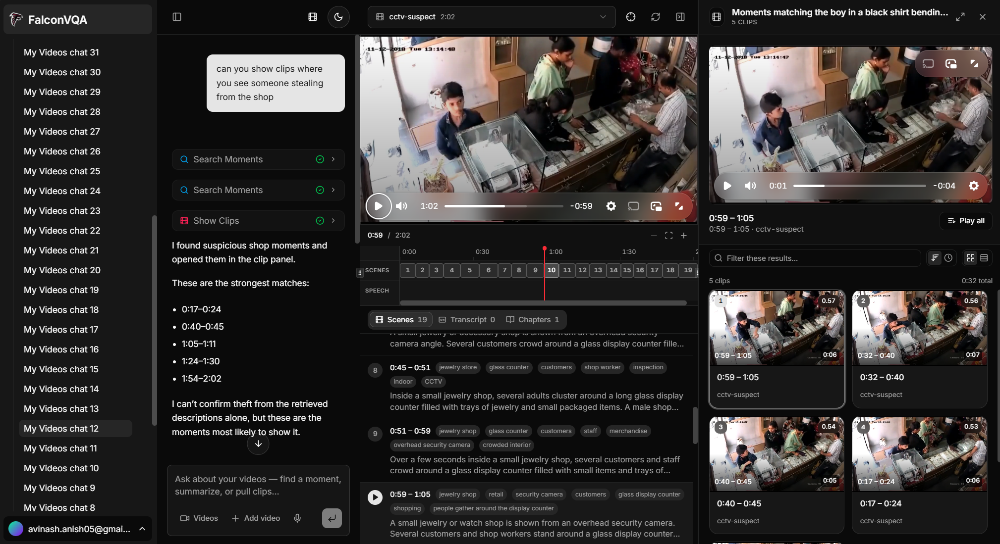
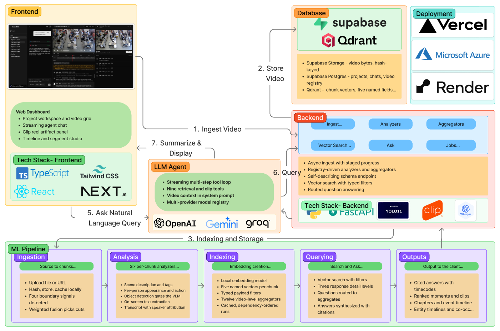

# FalconVQA

**Fast Augmented Language-based CONversational Video Question Answering.**


Ask questions about your videos and get answers grounded in what was actually said and shown,
with timestamps and playable clips.



- **core/** — the video RAG engine. Chunks a video, runs analyzers per chunk, aggregates to
  video level, indexes it all, then searches or answers questions over it. FastAPI + its own
  web UI on `:8077`
- **frontend/** — Next.js app: projects, upload, agent chat (AI SDK), clip artifact panel,
  and the documentation site at `/docs`
- **datasets/** — the test videos
- **latex/** — the report

```
Next.js  ──►  /api/agent (AI SDK tools)  ──►  core (FastAPI)  ──►  Qdrant + records
   │                                             │
   ├──► Supabase Storage (files → public URL)     └──► Supabase Storage (video bytes)
   └──► Supabase DB (projects, conversations, messages, video_core)
```



Everything except the vision-language calls and answer synthesis runs locally: BGE embeddings,
Qdrant (embedded), Whisper, pyannote, Silero VAD, PySceneDetect, CLIP, YOLO and EasyOCR.

---

## 1. Prerequisites

| What | Notes |
|---|---|
| Python 3.13 + a CUDA GPU | For core. Developed on torch 2.11.0+cu130 and an RTX 4060 (8 GB) |
| [uv](https://docs.astral.sh/uv/) | Manages core's Python environment |
| Node 20+ | For the frontend |
| Supabase project | URL, anon key, and service-role key |
| OpenAI API key | Core's VLM calls and answer synthesis |
| A model provider key | OpenAI / Google / Groq / Cerebras / xAI, or LM Studio locally, for the chat |

## 2. core

```bash
cd core
uv sync                              # pulls torch from the CUDA 13.0 index on Linux/Windows
cp .env.example .env                 # then fill in OPENAI_API_KEY, SUPABASE_URL, etc.

uv run serve.py                      # http://127.0.0.1:8077
```

`HF_TOKEN` is only needed for the `diarization` analyzer, and its model is gated — accept the
terms at <https://huggingface.co/pyannote/speaker-diarization-community-1> first.

Video bytes live in a public Supabase Storage bucket named `videos`, created once per project:

```python
from supabase import create_client
create_client(URL, SERVICE_ROLE_KEY).storage.create_bucket("videos", options={"public": True})
```

Verify: http://127.0.0.1:8077/health → `status: "ok"` with `storage.ok: true`, plus the
analyzers and aggregators this instance loaded. `degraded` means the key is wrong or the bucket
is missing — reads still work, ingest will not. API docs: http://127.0.0.1:8077/docs.

`uv run serve.py --api-only` drops core's own web UI and nothing else, which is what you want
behind the frontend.

## 3. Database

Run `frontend/lib/supabase/migrations/schema.sql` in the Supabase SQL editor. It creates
`projects`, `conversations`, `messages`, `video_core`, the `project-assets` bucket, and RLS policies.

## 4. frontend

```bash
cd frontend
npm install
cp env.example .env.local
npm run dev
```

Runs on http://localhost:3000. At minimum `.env.local` needs the three Supabase values, one
model provider key, and `CORE_API_URL` — which defaults to `http://127.0.0.1:8077`
Both servers need to be running: the frontend alone cannot ingest or retrieve.

---

## Using it

1. **Create a project** at `/projects` → "New Project". You land on the project workspace.
2. **Upload videos** — Upload using the upload videos button. Drop files in, or paste direct video URLs. Files go
   to Supabase Storage and core is handed the public URL; URLs core downloads itself. Pick the
   analyzers and the chunking mode in the same dialog — the analyzer list is fetched from core,
   not hardcoded.
3. **Wait for analysis.** Each card shows `queued` → `analyzing` (with the current stage) →
   `ready`. The grid polls and reconciles against core's job. Analysis is genuinely slow —
   several minutes for a short clip. Only `ready` videos are searchable.
4. **Ask something** in the prompt box (or click a suggestion card). This creates a chat with
   every ready video in scope.
5. **In the chat**, use the **Videos** button next to the model selector to tag exactly which
   videos to search. Tagged videos show as chips above the input.

### What to ask

| You say | The agent calls |
|---|---|
| "What is this about?" / "Why did X happen?" / "Summarise it" | `ask_video` — routed answer + source moments |
| "Find the moment where they discuss X" | `search_moments` — timestamped moments |
| "Show me clips of X" / "Make a highlight reel" | retrieval + `show_clips` → **artifact panel** |
| "What exactly did they say at 2:30?" | `get_video_transcript` |
| "How busy is it? What stands out? Chapters?" | `get_video_insights` — one video-level aggregate |
| "Who was in the video, and for how long?" | `get_video_entities` — people linked across chunks |
| "Tell me everything about that moment" | `read_chunks` — full stored analysis |

Clips open in the right-hand **artifact panel**: a player on top, the clip list below. Click any
row to play that moment; "Play all" plays them back to back. The chat message stays short and
cites `m:ss` timestamps.

---

## Docs

The full documentation site runs with the frontend at **http://localhost:3000/docs** — install,
configuration, the pipeline, analyzers, aggregators, chunking, retrieval, the workspace, and a
complete API reference.

Alongside the code:

- [core/README.md](core/README.md) — how the engine works
- [core/docs/ENDPOINTS.md](core/docs/ENDPOINTS.md) — core's HTTP API
- [core/docs/COMMANDS.md](core/docs/COMMANDS.md) — running, resetting, inspecting
