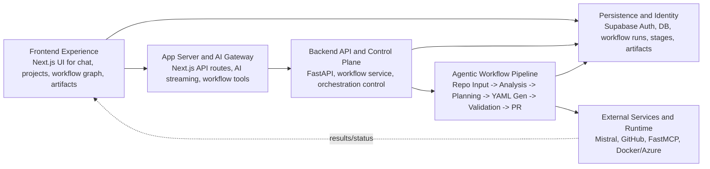
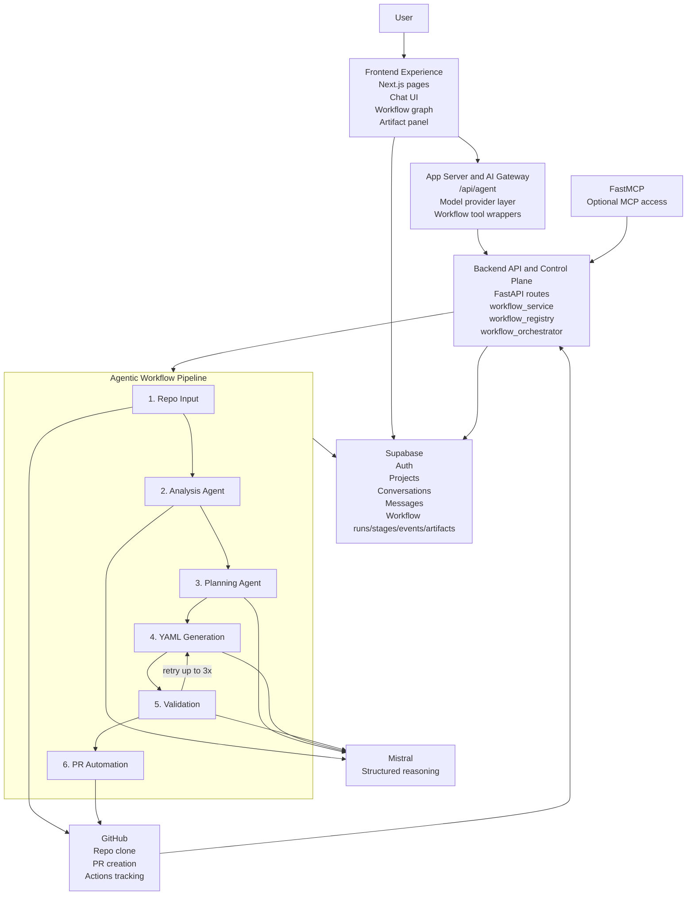

## Blocks

### Frontend Experience
- Next.js app for chat, projects, workflow graph, artifact viewing, and authenticated user operations.
- Main UI for triggering repository-driven CI/CD generation.
- Reads project, conversation, and workflow state from Supabase.

### App Server And AI Gateway
- Next.js server routes handle AI chat streaming and tool execution.
- `/api/agent` connects the chat UI to model providers and workflow tools.
- Forwards Supabase session context so backend actions can run on behalf of the user.

### Backend API And Control Plane
- FastAPI backend exposes workflow trigger, status, stop, credential, and GitHub Actions tracking endpoints.
- Shared workflow service is used by both FastAPI and FastMCP.
- Orchestrates asynchronous workflow runs and cancellation handling.

### Agentic Workflow Pipeline
- Six-stage pipeline:
  1. Repo Input
  2. Analysis Agent
  3. Planning Agent
  4. YAML Generation
  5. Validation
  6. PR Automation
- Generation and validation form a retry loop up to 3 attempts.
- Produces artifacts like repo facts, workflow plans, generated YAML, validation results, and PR metadata.

### Persistence And Identity
- Supabase Auth handles user identity and JWT-backed access.
- Supabase DB stores projects, conversations, messages, workflow runs, stages, events, and artifacts.
- RLS policies scope access to the owning user.

### External Services And Runtime
- Mistral provides structured reasoning for analysis, planning, generation, and validation.
- GitHub is the source repo, PR target, and GitHub Actions execution environment.
- FastMCP exposes the same backend workflow capability for MCP clients.
- Docker and Azure are the intended deployment/runtime options.

---

## Connections

- `Frontend Experience -> App Server And AI Gateway`
  - User chat and workflow actions go through `/api/agent`.

- `Frontend Experience -> Persistence And Identity`
  - Project lists, conversations, and workflow history are loaded from Supabase.

- `App Server And AI Gateway -> Backend API And Control Plane`
  - Workflow tools call backend trigger, status, and stop endpoints.

- `Backend API And Control Plane -> Persistence And Identity`
  - Workflow runs, stages, events, and artifacts are persisted to Supabase.

- `Backend API And Control Plane -> Agentic Workflow Pipeline`
  - FastAPI starts and manages the async six-stage orchestration flow.

- `Agentic Workflow Pipeline -> External Services And Runtime`
  - Uses Mistral for reasoning and GitHub for repo access, PR creation, and Actions tracking.

- `Agentic Workflow Pipeline -> Persistence And Identity`
  - Writes stage outputs and workflow artifacts to Supabase and local temp storage.

- `External Services And Runtime -> Frontend Experience`
  - Results return indirectly through backend state and frontend workflow views.

---

## Mermaid

## More detailed Mermaid

If you want, I can also turn this into a clean `ARCHITECTURE.md` file in the repo.